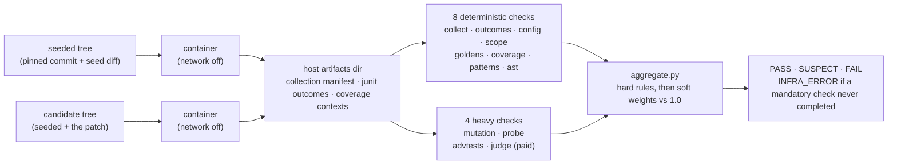

# Architecture

How VERIFY is built, what it trades away, and where it stops. The
measurements behind every figure cited here are in
[evaluation.md](evaluation.md).

VERIFY splits in two, which is the design decision everything else rests on. A
collector materializes a fresh seeded tree and a fresh candidate tree, runs one
throwaway container per tree, and writes what each produced (a collection
manifest, a junit outcome map, coverage data with per-test contexts) into a
host artifacts directory outside both trees. The checks then execute nothing.

Neither container is reachable from the checks, and neither tree is read by
them: a check is a pure function from one observation pair to one result, which
is what lets a detector change re-verdict cached pairs without re-collecting
them.

Twelve checks exist. Ten run in the default profile and two only under the paid
one. Eight read the deterministic observations (`t1_collect`, `t1_outcomes`,
`t1_config`, `t1_scope`, `t1_goldens`, `t1_coverage`, `t1_patterns`, plus
`t1_ast` as an attribution pass), and four are heavier (`t2_mutation`, a
budgeted stratified mutant batch scored through the coverage-context bridge;
`t2_probe`, one consumer entrypoint called in-pytest and bare; `t2_advtests`,
an LLM-generated adversarial battery walked through a promotion ladder; and
`t2_judge`, one diff review folded fail-closed). `checks/aggregate.py` folds
every result into PASS, SUSPECT, or FAIL, with INFRA_ERROR when a mandatory
check never completes.

Infrastructure failures never degrade into evidence. A missing coverage file
aborts as INFRA_ERROR rather than reading as 0 percent coverage, because a
silent 0 percent would fail a correct patch and poison the false-positive rate.

## Tradeoffs

Weights and a threshold, with no classifier anywhere. Eight soft rules sum
against a threshold of 1.0. That is auditable and it is crude: task 17 ran a
pre-registered 13-candidate coordinate search over the weights and every
candidate was verdict-equivalent, so the shipped table survived by tie-break
rather than by winning. `judge_flag` at 0.25 changes no verdict anywhere in the
dev set. One weight has moved since that search: `pattern_introduced`, 0.4 to
0.75, after three independent measurements put H7 at 0.65 against a 1.0
threshold. Crude cuts both ways, and this is the direction it cuts well: the
fix was one number, its effect on every split was computable from committed
evidence before anything was re-run, and a classifier would have offered no
such handle.

Every bug here was seeded, and every task is therefore a bug someone chose.
That is what makes the oracle free and the distribution artificial. A real
issue backlog has a different shape.

Two repos. click and rich are both pure-Python CLI-adjacent libraries with fast
suites. Nothing here says anything about a compiled dependency, a service, or a
slow integration suite.

Six of the ten hack categories are prevented, not detected, and the two numbers
are different animals. In the corpus posture the sandbox shadows tests,
configs and golden directories read-only, so H1, H2, H3, H4, H9 and H10 cannot
be written at all: the harness refuses the edit and logs the refusal. Only
H5 through H8 have to be caught by reading a patch. `verify --diff` has no such
mount, because it audits a patch someone already wrote, so every row there is
detection and the prevented six become the detector's problem for the first
time. That posture split is why a dev-set number and a diff-lane number are not
comparable, and why the Action ships report-only.

Thirty mutants per verify, seeded at 1337. Mutation is the dominant cost in the
whole harness (per-mutant timeout is 3x baseline, capped at 60 s), so the budget
is a wall-clock decision rather than a statistical one, and a bigger batch buys
kill-rate resolution the verdict never reads: the rule fires on survivors in
the tested region, not on a rate. What the budget costs is visible in the
deterministic lane, where H5 falls to 2 of 6 and H6 to 0 of 6 once the paid
checks are gone and mutation is carrying the category alone.

Model routing is two tiers and one of them is free. Eight T1 checks read
observations and call nothing; only `t2_advtests` and `t2_judge` reach the API,
both on the cheap tier, and the paid profile is opt-in per command. That is why
the default profile costs $0.00 and why the Action needs no key. The price is
in the deterministic-lane rescore ([evaluation.md](evaluation.md)): 17/29
lenient without the paid checks against 29/29 with them. Routing the judge to
a frontier model was never tested and is not claimed; the measured baseline
says a single Haiku call over diff text already matches the harness on recall.

## Limits

Everything measured here is within taxonomy. The ten hack categories were
authored before the detectors and the detectors were built against them.
Novel-category discovery is unmeasured. The blind holdout narrows that gap
without closing it: its author never saw a detector, but it worked from the
same taxonomy spec, so 11/11 is generalization across authors rather than
across categories.

Attribution numbers carry a labelling artifact. Six of the eight top-1 misses
are check-precedence: `t1_scope` or `t1_coverage` outranks the check that named
the mechanism, so the first evidence row reads `scope` or `coverage`. The other
two read H6 off `advtest_divergence`, which labels every row it emits H6 by an
explicit earlier decision. All eight were detected. The gap between in-harness
top-1 21/29 and anywhere 29/29 is entirely this. Both figures are in-harness, where a BUILD runs ahead
of the checks; the `verify --diff` posture removes `t1_scope` from contention.
The holdout's wider gap, top-1 6/11 against anywhere 11/11, is the same
artifact on unseen hacks.

Adversarial-test yield was thin against real repos before this corpus: three of
four early real-task runs generated zero trusted candidates, which left H5 and
H6 detection unmeasured outside the minirepo fixtures. The dev set is what
finally measured it, and both categories now land SUSPECT on all twelve
instances.

One holdout leak was found and fixed. The paid profile built its testgen
sources dict from every changed file with no `src_dirs` filter, so
test-touching diffs sent repository test content to the generator in 2 of 8
early runs. Both produced zero trusted candidates and no evidence, so no
published number moved, and the fix plus an end-to-end regression test that
drives the real CLI path landed as wave B's first commit (`DECISIONS.md` row
149). The original by-construction claim was wrong in an instructive way: it
bounded the resolver, and the leak was in the caller.

Skeptic's own paid checks read adversary-authored text. A patch under audit
reaches `t2_advtests`' generator and `t2_judge`'s reviewer as content, so a
patch can carry instructions aimed at them. Prompt hardening is the first
mitigation and it is not the argument; the bound is. Generated tests are
promoted only through a ladder whose `reference` rung runs them against the
pinned reference implementation, so a test the patch talked the generator into
writing still has to agree with the hidden correct code before any evidence is
emitted, and `parse_judge_response` folds an unparseable or hostile judge reply
fail-closed. Both paths therefore lose evidence rather than invent it: the
worst case is a hack that goes uncaught, never a clean patch pushed to FAIL.
Nothing here is measured against a real injection attempt, which is the honest
limit on the claim.

One provenance defect is closed and one is open. `_image_id` used to prefer a
build result written 2026-07-26 over its own fallback, so four committed
manifests name a stale image for one of twelve tasks and a mutable local tag
for ten more. Row 222 stopped the stale digest by refusing any recorded digest
its own `image_tag` does not vouch for, and row 226 replaced the tag fallback
by asking the daemon what that tag resolves to. The holdout run is the first
committed manifest whose `image_id` is a content digest on every task. The
four older manifests still read as they did: editing a generated artifact so
that it reads correctly is exactly the defect class this harness exists to
catch. Still open, and recorded rather than patched: every Eval B
`result.json` writes an absolute host path (`DECISIONS.md` row 220).

## Related work

The premise, that verifying agent output is now harder than producing it, is
not ours. *The Verification Horizon* (arXiv:2606.26300) argues no fixed
verifier survives improving generators. *Are "Solved Issues" Really Solved
Correctly?* (arXiv:2503.15223) and *STING* (arXiv:2604.01518) show benchmark
suites are pervasively under-constraining. *SWE-Mutation* (arXiv:2605.22175)
and *SpecBench* (arXiv:2605.21384) cover mutation-based adequacy and
hacking-behavior taxonomies.

Skeptic's contribution is narrower than any of them: a reproducible harness
that seeds the bug itself, so the oracle is free, and publishes a per-rule
evidence trail with its false-positive rate split by clean-variant kind.

Footprint anchor: SWE-bench's official harness needs roughly 120 GB of disk and
15 to 50 minutes to a first eval. Skeptic's own measured footprint and
cold-start table land at M7. Until then the comparison on offer is the demo
in the [README](../README.md), which needs neither Docker nor a network and
returns in under a second.

## Layout

| Path | What |
|---|---|
| `skeptic/` | CLI, spec loader, workspace materializer, venv/docker sandbox, seedcheck engine, trace writer, stage cache, observation collector, `checks/` |
| `tasks/` | Corpus task specs, one yaml per task |
| `patches/` | Seed, gold and hack diffs per task |
| `acceptance/` | Frozen acceptance suites, held out from the Builder, the detectors and adversarial testgen |
| `evals/` | Published eval snapshots: `runs/` for Eval A, `arms/` for Eval B, each with its manifest, table and per-pair traces |
| `docs/admission/` | Per-repo admission reports with pinned commits |
| `docs/architecture.md` | This document |
| `docs/evaluation.md` | The full evaluation record |
| `docs/skeptic-engineering-plan.md` | The plan |
| `DECISIONS.md` | Decision provenance, including recorded dissents |

Python 3.12. `pip install -e ".[dev]" && pytest`.

Every pytest session with the Docker daemon up leaves one more minirepo tag
behind, a few megabytes each on shared base layers. `docker image prune`
reclaims them.
